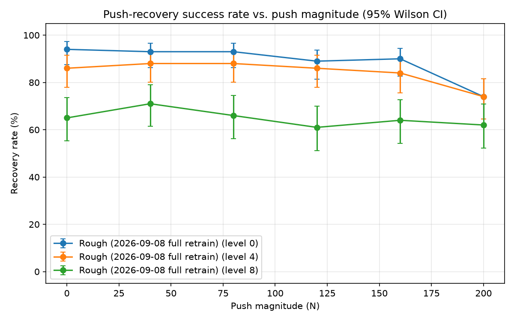

# Go2 Locomotion Policy

A learned walking policy for the Unitree Go2 quadruped, trained in Isaac Lab.
It walks on flat ground and rough, stepped terrain, follows a commanded velocity, and recovers from pushes.

<!-- Video/gif showcase goes here -->

---

## What it does

- Follows a commanded forward, sideways, and turning speed.
- Walks across flat ground, boxes, slopes, and stairs, both ascending and
  descending.
- Recovers from a sideways push without falling.
- Does not use vision. It only feels the ground through joint and body
  sensors (proprioception).

---

## How it was trained

Trained with PPO (`rsl_rl`) inside Isaac Lab, using 4096 simulated robots
running in parallel on a single GPU. The training goal is velocity tracking:
the robot is given a random target speed and turn rate, and rewarded for
matching it smoothly, not for reaching any destination.

Two things ramp up in difficulty over training:

- **Terrain difficulty.** The robot starts on flat, easy terrain and moves up
  a ladder of harder terrain (stairs, boxes, slopes, uneven ground) as it
  proves it can handle each level.
- **Push disturbance.** Random sideways shoves start weak and grow stronger
  over training, following a curriculum from Hwangbo et al. 2019.

Network: a small MLP (512, 256, 128 units) for both the actor and critic,
trained for 1500 iterations per run.

See `REFERENCES.md` for the full reasoning behind these choices, and
`runs/RUN_001.md` and `runs/RUN_002.md` for the detailed session logs.

---

## Checkpoints

Both checkpoints from this run (flat-terrain, and rough-terrain with push
recovery) are public. Grab one with:

```bash
python3 scripts/fetch_checkpoint.py locomotion go2_locomotion_v1_candidate.onnx
```

Drop the filename to fetch every locomotion checkpoint at once. Use the
`flat` file for the flat-only policy, or swap `.onnx` for `.pt` if you want
the raw checkpoint instead of the exported inference format.

---

## Results

Push recovery rate across a range of push strengths and terrain difficulty
levels (100 trials per cell):



| Push magnitude | Easy terrain | Medium terrain | Hard terrain |
|---|---|---|---|
| 0 N | 94% | 86% | 65% |
| 40 N | 93% | 88% | 71% |
| 80 N | 93% | 88% | 66% |
| 120 N | 89% | 86% | 61% |
| 160 N | 90% | 84% | 64% |
| 200 N | 74% | 74% | 62% |

Recovery rate by terrain type (pooled across all push strengths and
difficulty levels):

| Terrain type | Recovery rate |
|---|---|
| Random rough ground | 92% |
| Slopes (up and down) | 91% |
| Stairs (ascending) | 83% |
| Stairs (descending) | 66% |
| Boxes | 64% |

Boxes and descending stairs are the two weakest terrain types. Everything
else holds up well even under a strong push.

---

## Known limitations

- Recovery on boxes and descending stairs is noticeably weaker than on other
  terrain. Not yet root caused.
- No perception. The policy cannot see obstacles ahead of time, only react
  once it touches them. Vision is planned as a separate policy layered on
  top rather than folded into this network.
- This checkpoint is a candidate, not final. It still needs to pass a
  separate adversarial robustness check before anything else builds on it.

---

## References

1. Rudin, N., Hoeller, D., Reist, P., Hutter, M. (2022). Learning to Walk in
   Minutes Using Massively Parallel Deep Reinforcement Learning. *CoRL 2022*.
2. Hwangbo, J., Lee, J., Dosovitskiy, A., Bellicoso, D., Tsounis, V., Koltun,
   V., Hutter, M. (2019). Learning agile and dynamic motor skills for legged
   robots. *Science Robotics*, 4(26).
3. Lee, J., Hwangbo, J., Wellhausen, L., Koltun, V., Hutter, M. (2020).
   Learning quadrupedal locomotion over challenging terrain. *Science
   Robotics*, 5(47).
4. Miki, T., Lee, J., Hwangbo, J., Wellhausen, L., Koltun, V., Hutter, M.
   (2022). Learning robust perceptive locomotion for quadrupedal robots in
   the wild. *Science Robotics*, 7(62).
5. Shi, F., Zhang, C., Miki, T., Lee, J., Hutter, M., Coros, S. (2024).
   Rethinking Robustness Assessment: Adversarial Attacks on Learning-based
   Quadrupedal Locomotion Controllers. *RSS 2024*.

Full reasoning for what was taken from each paper, and what was deliberately
left out, is in `REFERENCES.md`.
